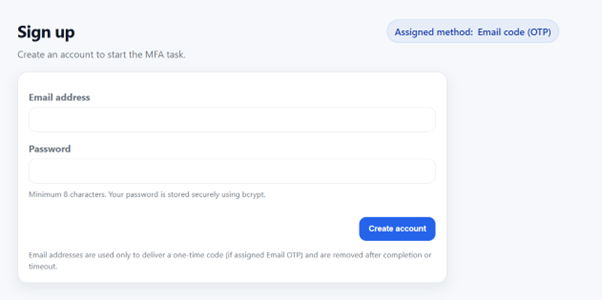
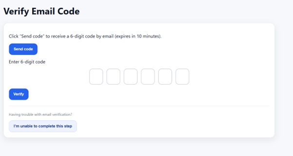
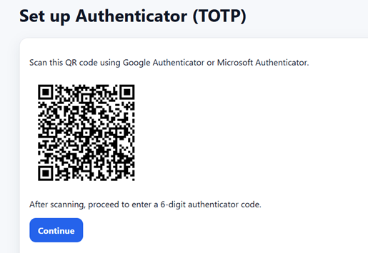
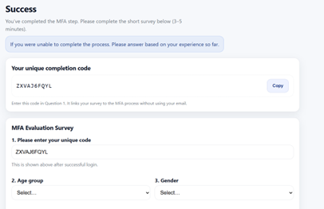
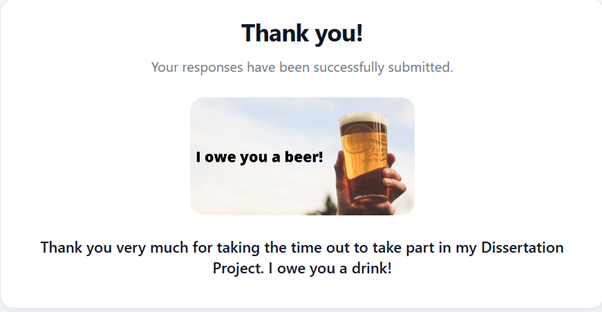

# Multi-Factor Authentication Deployment Dissertation
Overview

This project was developed as part of my Honours Year Dissertation and aims to evaluate the usability of different Multi Factor Authentication (MFA) methods for non-technical users. I have developed a system which explores whether MFA is perceived as a barrier or as an additional layer of security. 

The application guides users through a structured authentication process, each method is randomised. The two methods used were Email One-Time Passcode (OTP) and Time-Based One-Time Passcode (TOTP). After participants had either completed or been unable to complete the process, they would then have the chance to fill out a short questionnaire. The questionnaire captured user feedback and performance data. 

Final System
The final system is a fully functional web application built using Node.js, incorporating both frontend and backend components. Key features include:

	Instructional videos embedded in the web application for user guidance 

	User account creation and login

	Email OTP authentication

	TOTP (Authenticator App) set up and verification

	Questionnaire for user feedback

	Unique participant completion identifiers 

Deployment and Security 

The system was deployed on a virtualised environment using Proxmox, with an Ubuntu Server virtual machine hosting the web application. 

A domain was provided via CSE Connect, which allowed participants to access the system remotely. This enabled real-world testing beyond the local testing environment.

The application was served using NGINX as a reverse proxy, which improved reliability and handling incoming web traffic more efficiently. 

Once the domain was live security was implemented using HTTPS with TLS encryption, which ensured all communication between users and the system were securely transmitted. 

User Flow 

The following screenshots illustrate the complete user journey:

Development Process 

The system was developed through multiple stages:

	Prototype 1 – Basic login interface 

	Prototype 2 – Static MFA implementation 

	Prototype 3 – Interactive system 

	Final System – Fully functional deployed Application

All prototypes are included in this repository to demonstrate progression and the designs evolution. 

Results Summary

A total of 37 participants completed the study. 

MFA Completion Rates
 
	Email OTP: 17/18 completed 

	TOTP 12/19 completed

	1 Participant was unable to complete EmailOTP 

	7 Participants were unable to complete TOTP 

This result suggests that more complex MFA methods, such as TOTP may introduce usability challenges for non-technical users. 

Supporting Materials 

Additional materials were given to every participant during the study, and these include:

	Guidance documents           /GuidanceDocs

	Instructional videos            /videos

	Prototype versions             / prototypes

Ethics and Consent 

Before conducting the study, ethical approval was obtained. Participants provided informed consent through an approved institutional consent form.
A total of 41 consent forms were received, with 37 participants completing the study. All collected data was fully anonymised. 

Running the Project

The system was deployed and accessed through a live web interface using a configured domain. This allowed participants to interact with the application directly via their own chosen browser. 

As the project relies on a virtual environment and specific deployment configurations, it is now no longer intended to run locally without additional setup. 

The application was fully operational during testing, 37 participants were able to use it successfully to complete the MFA tasks and questionnaire. 

